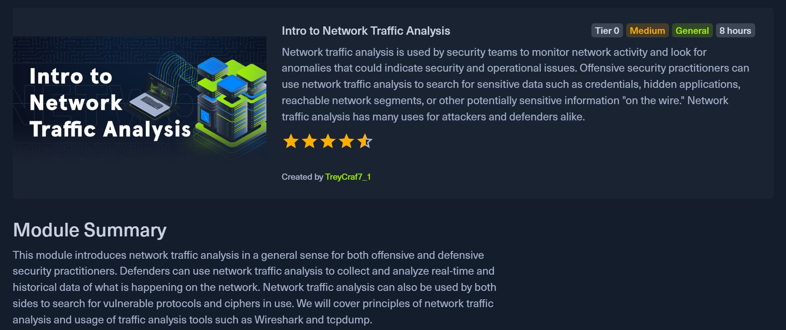

# HTB Academy: Introduction to Network Traffic Analysis 💻🔍

*HTB Academy: Intro to Network Traffic Analysis*

## Problem Statement
Network security professionals need to effectively capture, analyze, and interpret network traffic to identify security threats, troubleshoot network issues, and understand communication patterns between hosts and servers. This module by Hack the Box provided me with insights and skills relating to network traffic analysis.

## Approach
- **Theoretical Foundation**: Understanding OSI/TCP-IP models and networking fundamentals
- **Hands-on Practice**: Practical labs using command-line and GUI-based packet analysis tools
- **Progressive Learning**: Starting with basic packet capture, advancing to filtering, analysis, and decryption
- **Real-world Application**: Analyzing various protocols (HTTP, HTTPS, DNS, FTP, RDP) in captured traffic

## Tools Used
- **TCPDump**: Command-line packet analyzer for capturing and filtering network traffic
- **Wireshark**: GUI-based network protocol analyzer for deep packet inspection and analysis

## Key Lessons Learned
- **Packet Capture Fundamentals**: Interface selection, capture filters, and saving/reading PCAP files
- **Traffic Analysis**: Identifying protocols, ports, conversations, and communication patterns
- **Filtering Techniques**: Using capture and display filters to isolate specific traffic types
- **Protocol Analysis**: Deep inspection of HTTP, DNS, FTP, and encrypted RDP traffic
- **Security Applications**: Detecting authentication methods, extracting objects from HTTP traffic, and decrypting encrypted sessions

--