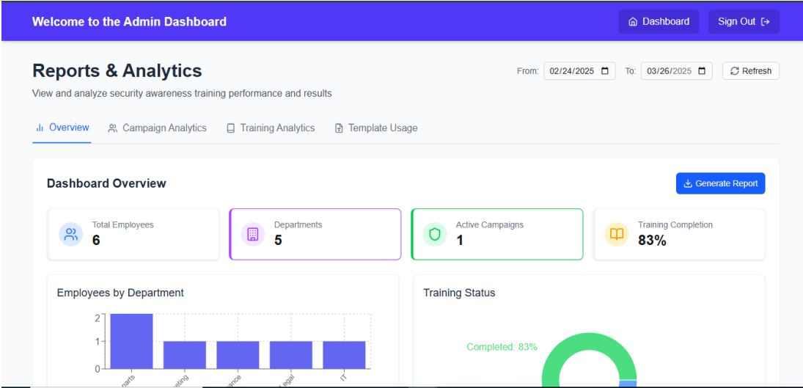
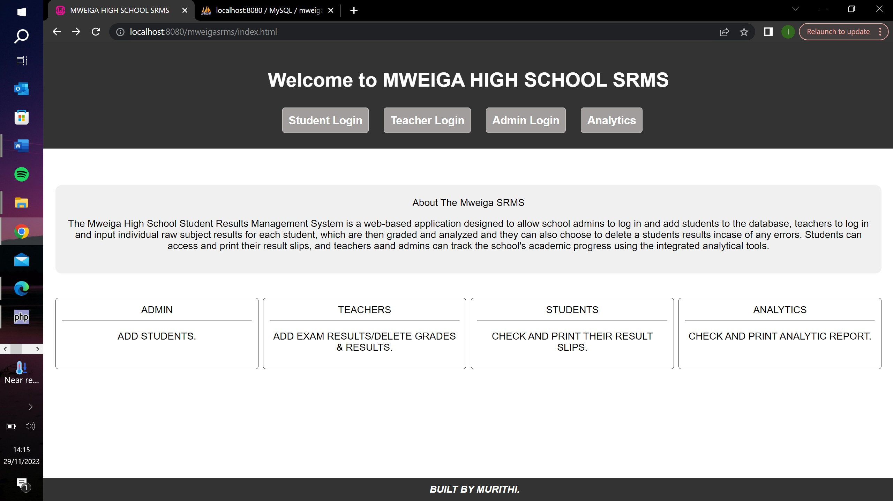

# 🚀 My Projects Portfolio

---

## 💼 **Technical Showcase & Professional Work**

Welcome to my projects portfolio! Here you'll find a collection of projects ive done and worked on over time.

---

## 🛡️ **Projects**

### **Project 1: Phishing training and awareness simulation platform**

#### 📋 **Project Overview**
A comprehensive platform for an enterprise organization to manage phishing simulations and dispense training to employees.

#### 🎯 **Key Features**
-Simulations management
-Template management
-User and departments management
-Reports and analytics
-Training material management

### **Project 2: Students Results Management System for Mweiga Secondary School**

#### 📋 **Project Overview**
A results management platform for a mixed secondary school with result slip generation and report generation.

#### 🎯 **Key Features**
-Student management
-Results management
-Reports and slip generation

#### 🔗 **Project Link**
**[📂 View on GitHub](https://github.com/ianjoshua-M/MWEIGA-SRMS)**

### **Project 3: Quizz app**

#### 📋 **Project Overview**
A python application that lets the user upload pdf files of question dumps and attempt the questions.

#### 🎯 **Key Features**
-Easy study of question dumps
-Interactive navigation

#### 🔗 **Project Link**
**[📂 View on GitHub](https://github.com/ianjoshua-M/quizz_app)**

---

